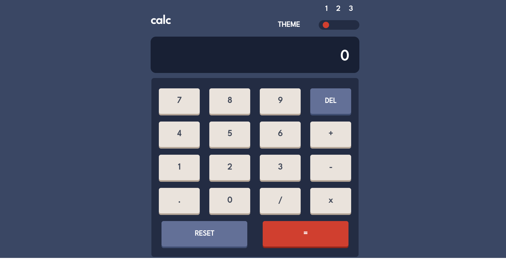

# Frontend Mentor - Calculator app solution

This is a solution to the [Calculator app challenge on Frontend Mentor](https://www.frontendmentor.io/challenges/calculator-app-9lteq5N29). Frontend Mentor challenges help you improve your coding skills by building realistic projects. 

## Table of contents

- [Overview](#overview)
- [The challenge](#the-challenge)
- [Screenshot](#screenshot)
- [Links](#links)
- [Built with](#built-with)
- [Author](#author)
- [Acknowledgments](#acknowledgments)

**Note: Delete this note and update the table of contents based on what sections you keep.**

## Overview

### The challenge

Users should be able to:

- See the size of the elements adjust based on their device's screen size
- Perform mathmatical operations like addition, subtraction, multiplication, and division
- Adjust the color theme based on their preference
- **Bonus**: Have their initial theme preference checked using `prefers-color-scheme` and have any additional changes saved in the browser

### Screenshot

### Links

- Solution URL: [solution URL](https://github.com/samdem-ai/Calculator-app)
- Live Site URL: [live site URL](https://samdem-ai.github.io/Calculator-app)

### Built with

- Semantic HTML5 markup
- CSS custom properties
- Flexbox
- Grid layout
- Mobile-first workflow

## Author

- Website - [Debaili samy](https://samdem-ai.github.io/personalSite)
- Frontend Mentor - [@samdem-ai](https://www.frontendmentor.io/profile/samdem-ai)

## Acknowledgments

a big Thank you to both of  colt steele and the net ninja who are helping me through my frontend developenent carrer
